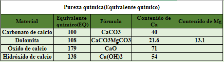

<html>

<head>

 

</head>

   <body>
   

  
<H5>
<b>Enmiendas para suelos ácidos por medio de saturación de bases</b>
  </H5>

  <body>
  

  {height=130px}  

  
Fuente: Diego Villaseñor. 
 
  
 
   <form name="MyForm">
      <strong>Saturación de bases deseada:</strong><input type="text" name="numero1" size="20">  
     <strong> Saturación de bases actual:</strong><input type="text" name="numero2" size="20">  
      <strong>Capacidad de Intercambio catiónico(meq/100g):</strong><input type="text" name="numero3" size="20">  
      <strong>PRNT:</strong><input type="text" name="numero4" size="20">  
     <strong>Necesidad de cal agrícola (t/ha):</strong>        <input type="text" name="resultado" size="20">  
     
<input type="button" value="Calcular" onclick="real()"><input type="reset" value="Eliminar">
       
  
  </form>
   
<form name="MyForma">
      <strong>Equivalente químico:</strong><input type="text" name="numero1" size="20">  
     <strong> Eficiencia granulométrica:</strong><input type="text" name="numero2" value="95" size="20">  
     <strong>PRNT:</strong> <input type="text" name="resultado" size="20">  
     
<input type="button" value="Calcular" onclick="prnt()"><input type="reset" value="Eliminar">
       
  

  </form>
  
    
  </body>
 
 
   </body>
   
  

</html>