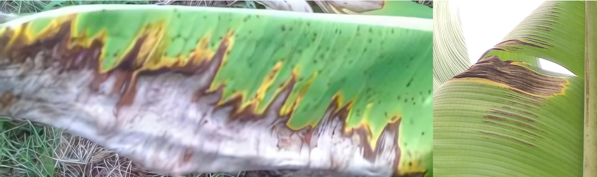
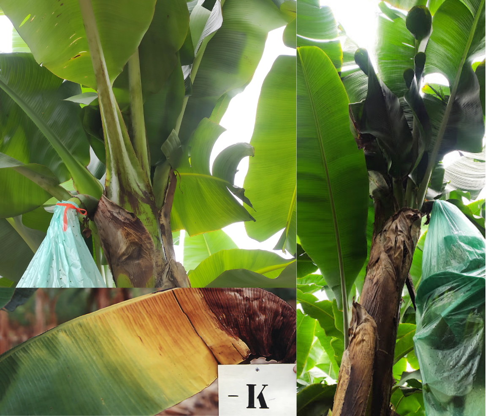
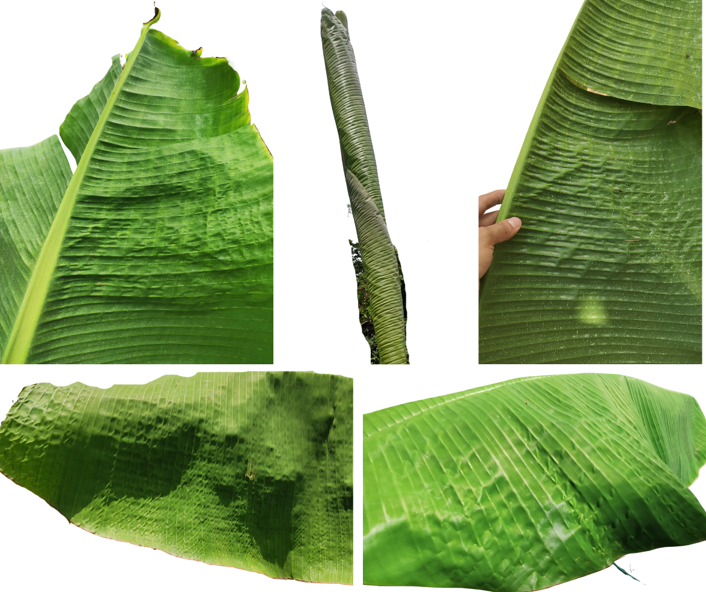
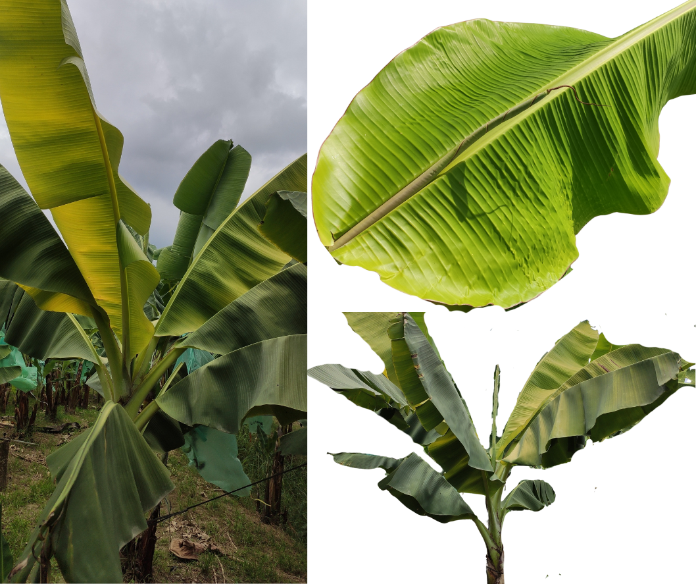
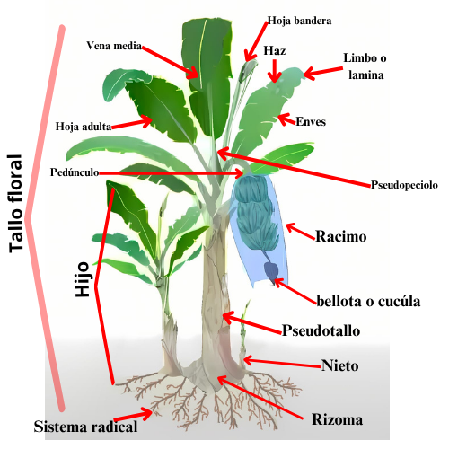
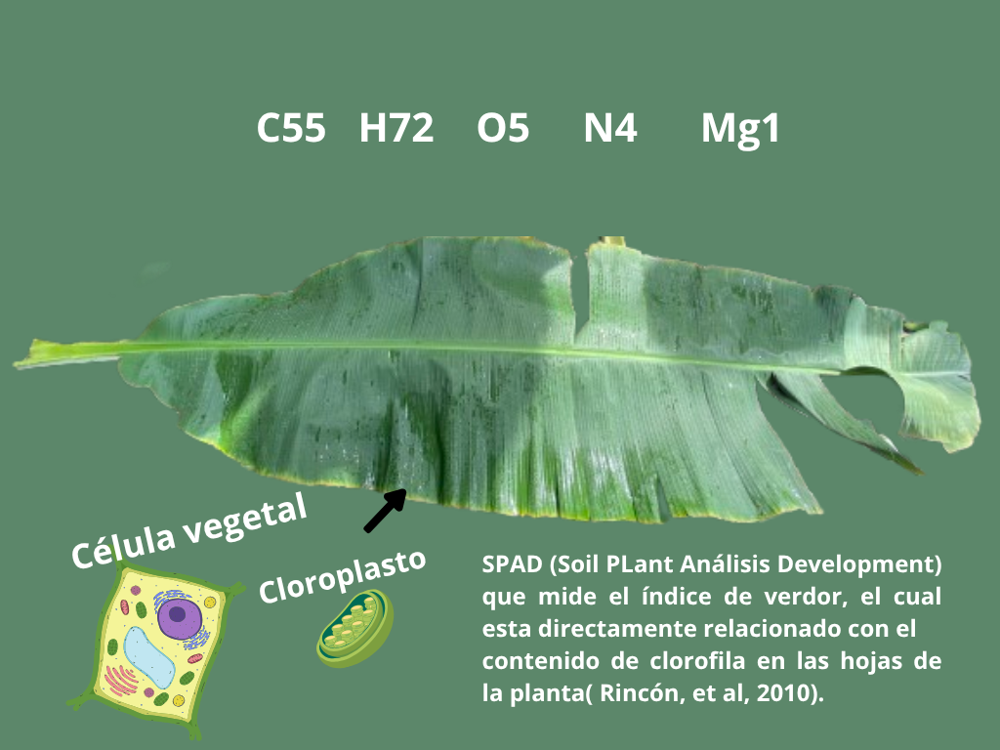

  <button class="nav-btn" onclick="showSection('Morfología')">Morfología</button>
  <button class="nav-btn" onclick="showSection('Fotosíntesis')">Fotosíntesis</button>
  <button class="nav-btn" onclick="showSection('Clorofila')">Clorofila</button>
  <button class="nav-btn" onclick="showSection('Nutrientes')">Nutrientes</button>
  <button class="nav-btn" onclick="showSection('nitrogeno')">Nitrógeno</button>
  <button class="nav-btn" onclick="showSection('fosforo')">Fósforo</button>
  <button class="nav-btn" onclick="showSection('potasio')">Potasio</button>
  <button class="nav-btn" onclick="showSection('magnesio')">Magnesio</button>
  <button class="nav-btn" onclick="showSection('calcio')">Calcio</button>
  <button class="nav-btn" onclick="showSection('azufre')">Azufre</button>
  <button class="nav-btn" onclick="showSection('boro')">Boro</button>
  <button class="nav-btn" onclick="showSection('zinc')">Zinc</button>

  <h2>Signos de Deficiencia de Nitrógeno</h2>
  <ul>
    <li><strong>Clorosis</strong>: Amarillamiento de las láminas de las hojas.</li>
    <li><strong>Tinte rosado-rojizo</strong>: Aparece en las nervaduras y pecíolos.</li>
    <li><strong>Espacio reducido entre las hojas sucesivas</strong>: Esto da lugar a un aspecto de arrepollamiento y dificulta el crecimiento general de la planta.</li>
    <li><strong>Peciolos finos, cortos y comprimidos</strong>: Afectando la estructura de la planta.</li>
    <li><strong>Disminución de yemas</strong>: Lo que reduce la capacidad de crecimiento vegetativo.</li>
  </ul>
  
   
Figura 1: Autor, 2025

  <h2>Signos de Deficiencia de Fósforo</h2>
  <ul>
    <li><strong>Necrosis Marginal en Forma de Sierra</strong>: Se observa principalmente en las hojas más viejas, con un color verde oscuro azulada.</li>
    <li><strong>Coloración Morada</strong>: Las hojas pueden presentar una coloración morada, debido al acumulamiento de azúcares que provocan un aumento de pigmentos llamados antocianinas.</li>
    <li><strong>Reducción en el Crecimiento</strong>: La deficiencia de fósforo afecta tanto el crecimiento de la planta madre como de los hijos, lo que compromete la salud general de la planta.</li>
    <li><strong>Curvatura de las Hojas</strong>: Puede causar que los pecíolos se quiebren.</li>
    <li><strong>Estrés Adicional</strong>: Las hojas se vuelven de un verde intenso.</li>
  </ul>
  
    
Figura 2: Bolaños, et al. (2024); Autor, 2025

  <h2>Signos de Deficiencia de Potasio</h2>
  <ul>
  <li><strong>Amarillamiento y Enrollamiento de las Hojas</strong>: Las hojas más bajas muestran amarillamiento y un enrollamiento hacia adentro, especialmente en las hojas más viejas.</li>
    <li><strong>Coloración Amarillo-Anaranjada</strong>: Se observa en las puntas de las hojas más viejas, seguida de necrosis que se extiende rápidamente hacia la base hasta que la hoja se seca por completO.</li>
    <li><strong>Arrepollamiento</strong>:El fenómeno conocido como arrepollamiento, que es una obstrucción foliar, afecta el crecimiento y desarrollo de la planta.</li>
    <li><strong>Racimos Cortos</strong>:Los racimos se vuelven cortos, enconchados y no alcanzan su desarrollo pleno.</li>
    <li><strong>Deterioro de Síntesis de Proteínas</strong>: La deficiencia de potasio afecta la síntesis de proteínas, el transporte de azúcares y la utilización de nitrógeno, lo que provoca acumulación de estos en las plantas.</li>
  </ul>
  

  
    
Figura 3: Borges, et al. (2006); Autor, 2025

  

  <h2>Signos de Deficiencia de Magnesio</h2>
  <ul>
    <li><strong>Disminución de Intensidad Verde</strong>: Las láminas foliares muestran una disminución en la intensidad verde, acompañada de halos cloróticos alargados en las hojas más viejas.</li>
    <li><strong>Manchas Purpúreas en los Pecíolos</strong>: Se observan manchas purpúreas en los pecíolos, junto con necrosis en las láminas foliares y la separación y ruptura de las vainas.</li>
    <li><strong>Amarillamiento en los Semilímbos</strong>: El signo característico de la deficiencia de magnesio es el amarillamiento o clorosis en la zona central de los semilímbos de las hojas más maduras.</li>
    <li><strong>Pigmentación Azulada en los Pecíolos</strong>: En casos severos de deficiencia, puede aparecer una pigmentación azulada en los pecíolos de la planta.</li>
  </ul>
  

  
    
Figura 4: Autor, 2025

  

  <h2>Signos de Deficiencia de Calcio</h2>
  <ul>
    <li><strong>Ruptura de las Paredes Celulares</strong>: Una falta de calcio en la solución del suelo provoca una deficiencia de pectatos de calcio, resultando en la ruptura de las paredes celulares y decoloración del contenido citoplasmático, que se dispersa en los espacios intercelulares, ocasionando tonalidades de marrón claro a rojizo.</li>
    <li><strong>Manifestación en Hojas Jóvenes</strong>: La deficiencia de calcio se observa principalmente en las hojas más jóvenes debido a la escasa movilidad de este nutriente dentro de la planta.</li>
    <li><strong>Dificultades de Absorción</strong>:La escasa movilidad del calcio en el suelo, su limitada absorción por la planta, y factores como antagonismos con otros elementos, las condiciones del suelo y el desarrollo de las raíces, dificultan la absorción de este nutriente.</li>
    <li><strong>Necrosis de las Raíces</strong>: En diversos cultivos, la falta de calcio ocasiona el acortamiento, engrosamiento y necrosis de las raíces.</li>
  </ul>
  

  
    
Figura 5: Autor, 2025

  

  <h2>Signos de Deficiencia de Azufre</h2>
  <ul>
    <li><strong>Clorosis en Hojas Jóvenes</strong>: La deficiencia de azufre se manifiesta principalmente en las hojas jóvenes, con un amarilleo que se presenta como una clorosis amarillenta.</li>
    <li><strong>Parches Necróticos en los Bordes de las Hojas</strong>: Se observan parches necróticos en los bordes de las hojas, acompañados de un leve engrosamiento de las venas.</li>
    <li><strong>Frecuencia en Suelos Gruesos</strong>: Esta deficiencia es más común en suelos de textura gruesa con bajos niveles de materia orgánica. Se ha documentado un aumento significativo de la deficiencia de azufre en áreas con estas características.</li>
  </ul>
  

  
    
Figura 6: Autor, 2025

  

  <h2>Signos de Deficiencia de Boro</h2>
  <ul>
    <li><strong>Clorosis Intervenal y Deformación de las Hojas</strong>: La deficiencia de boro se manifiesta en clorosis intervenal en las láminas de las hojas, acompañada de deformación, reducción de tamaño y curvatura en las hojas emergentes.i><strong>Rayas Cloróticas Cortas</strong>:En los primeros estados de deficiencia, se aprecian rayas cloróticas cortas distribuidas paralelamente a la vena central de las hojas.</li>
    <li><strong>Deformaciones en los Frutos</strong>: Esta deficiencia también afecta el período de floración, provocando deformaciones en los frutos.</li>
  </ul>
  

  
    
Figura 7: Autor, 2025

  

  <h2>Signos de Deficiencia de Zinc</h2>
  <ul>
    <li><strong>Racimos Pequeños y Deformados</strong>: La deficiencia de zinc se manifiesta en racimos pequeños y deformados, con poca proliferación de raíces.</li>
    <li><strong>Reducción de Tamaño y Peso de los Frutos</strong>:  La deficiencia de zinc puede reducir el peso y tamaño de los frutos, así como alterar la formación de las manos de banano.</li>
    <li><strong>Desarrollo Atrofiado y Hojas Alargadas</strong>:Las plantas afectadas muestran un desarrollo atrofiado. Sus hojas se tornan alargadas, estrechas y amarillentas, con líneas cloróticas entre las venas secundarias y una coloración amarilla en el envés de la hoja.</li>
  </ul>
  

  
    
Figura 8: Autor, 2025

  

  
   
Figura 9: Autor, 2025

 

  <ul>
    <li><strong>La fotosíntesis</strong>: es un proceso esencial mediante el cual las plantas capturan energía luminosa y la transforman en energía química, suministrando la energía y el carbono necesarios para su metabolismo. En el caso del banano, una planta autótrofa, la cantidad de radiación fotosintéticamente activa que recibe es crucial para su crecimiento. Además, factores ambientales como el estado hídrico y las condiciones de radiación incidente también influyen en su tasa fotosintética (Rodríguez et al., 2002; Bryant et al., 2006).</li>
  </ul>
  

  
    
Autor, 2025

  

  <ul>
    <li><strong>El contenido de clorofila</strong>:  en las hojas emerge como una variable crucial del estado fisiológico de una planta. Esta sustancia contiene pigmentos esenciales que permiten la conversión de la energía luminosa en energía química, además de influir en la cantidad de radiación solar absorbida por la hoja. Esta relación entre el contenido de clorofila y la eficiencia fotosintética de la planta es fundamental. Dado que una proporción considerable de nitrógeno se encuentra presente en este pigmento, la medición de clorofila proporciona una estimación indirecta del estado nutricional de la planta. Es importante destacar que el contenido de clorofila se ve afectado directamente por factores como el estrés y la senescencia de la planta (Steele, et al, 2008).</li>
  </ul>
  

  
    
Autor, 2025

  

  <ul>
    <li><strong>Funciones de los nutrientes </strong>: Un elemento esencial se define como aquel cuya falta impide a una planta completar su ciclo vital o alguna función fisiológica. Si las plantas reciben estos elementos fundamentales junto con la energía solar, pueden producir todos los compuestos necesarios para su crecimiento normal. Los tres primeros elementos, hidrógeno, carbono y oxígeno, no se clasifican como nutrientes minerales ya que se obtienen principalmente del agua o del dióxido de carbono (Taiz, et. al,2002).
    
De acuerdo con Arnon &  Stout (1939), un elemento se considera esencial únicamente si se cumplen las siguientes condiciones: 

a. La ausencia del elemento impide que la planta complete su fase vegetativa o reproductiva. 
b. La deficiencia del elemento es específica y solo puede prevenirse o corregirse mediante su suministro. 
c. El elemento juega un papel directo en la nutrición y el metabolismo de la planta. 
d. El elemento contribuye directamente a la nutrición de la planta y ayuda a corregir condiciones microbiológicas o químicas desfavorables del suelo o sustrato.
</li>
  </ul>
  

  
    
Autor, 2025

  

