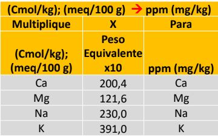

<html>

<head>

 

</head>

<body> 

 <body> 
    

  {height=160px} 

  
Fuente:Ing.Diego R. Villaseñor Ortiz

   <body>   <H5>
<b>Calculo de bases</b>
  </H5>
   </body>
  <body>
    <form name="MyForm">

      Ingrese calcio (mq):<input type="text" name="numero1" size="20">  
      Ingrese calcio(mg/Kg):<input type="text" name="numero2" size="20">  
     Resultado en (mg/Kg)Ca:        <input type="text" name="resultado" size="20">  
     
<input type="button" value="Calcular" onclick="ca()">
     <input type="reset" value="Eliminar">
        
 
         
  </form>

  

  <body>
    <form name="MyForm2">

      Ingrese magnesio (mq):<input type="text" name="numero3" size="20">  
      Ingrese magnesio(mg/Kg):<input type="text" name="numero4" size="20">  
     Resultado en (mg/Kg)Mg:        <input type="text" name="resultado" size="20">  
     
<input type="button" value="Calcular" onclick="Mg()">
     <input type="reset" value="Eliminar">

         
  </form>
   
  
    <body>
    <form name="MyForm3">

      Ingrese sodio (mq):<input type="text" name="numero5" size="20">  
      Ingrese sodio (mg/Kg):<input type="text" name="numero6" size="20">  
     Resultado en (mg/Kg)Na:        <input type="text" name="resultado" size="20">  
     
<input type="button" value="Calcular" onclick="so()">
     <input type="reset" value="Eliminar">
      
   
  </form>
 
  
    <body>
    <form name="MyForm4">

      Ingrese potasio (mq):<input type="text" name="numero7" size="20">  
      Ingrese potasio (mg/Kg):<input type="text" name="numero8" size="20">  
     Resultado en (mg/Kg)K:        <input type="text" name="resultado" size="20">  
     
<input type="button" value="Calcular" onclick="POTA()">
     <input type="reset" value="Eliminar">
         

  </form>
 
  
    
  </body>
 
 
   </body>
   
  

</html>
########################################################
 
<html>

<head>

 

</head>

<body> 

 
   <body>   <H5>
<b>Convertir de mg/Kg a Kg(/Ha)</b>
  </H5>
   </body>

  <body>
    <form name="MyForm5">

      Ingrese base(mg/Kg):<input type="text" name="numero4" size="20">  
      Ingrese factor :<input type="text" name="numero5" size="20">  
     Resultado en Kg(/Ha):        <input type="text" name="resultado" size="20">  
     
<input type="button" value="Calcular" onclick="fa()">
     <input type="reset" value="Eliminar">
         

  </form>

  
  </body>
 
 
   </body>
   
  

</html>