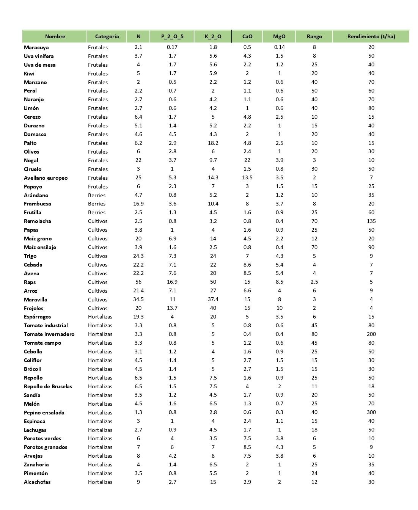

<html>

<head>

 
</head>

   <body>
   

<H5>
<b>Demanda del cultivo</b>
  </H5>
  <body>
  

  {height=1100px}  
 
  
Fuente: Ivan Vidal P. 
 
 <body>
    <form name="MyForm">

      Ingrese Nutriente :<input type="text" name="numero1" size="20">  
      Ingrese Rendimiento:<input type="text" name="numero2"  size="20">  
       Resultado  :        <input type="text" name="resultado" size="20">  
     
<input type="button" value="Calcular " onclick="ciclo()">
       <input type="reset" value="Eliminar">
 
       </form>
       </form>
    
    
  </body>
 
 
   </body>
   
  

</html>