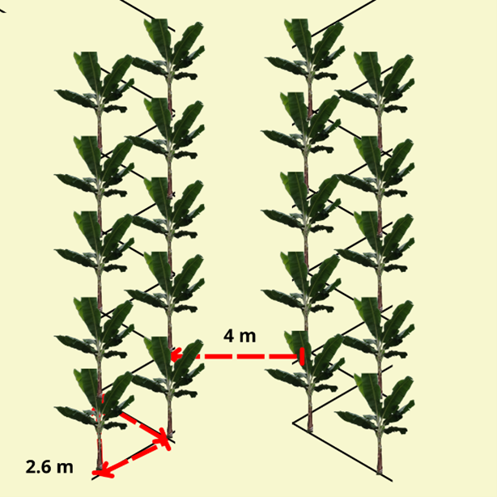

```{=html}
<div id="coca">
  <div style="text-align:center;">
    <h3 style="font-family:'Times New Roman';">Densidad triángulo (tres bolillos) doble hilera</h3>
    
  </div>

  <form name="MyForm" style="font-family:'Times New Roman'; color:#424949; padding: 10px;">
    <label><strong>Distancia entre plantas que forman el triángulo:</strong></label><br>
    <input type="text" name="numero1" size="20"><br><br>

    <label><strong>Distancia diagonal entre surcos:</strong></label><br>
    <input type="text" name="numero2" size="20"><br><br>

    <label><strong>Altura (h):</strong></label><br>
    <input type="text" name="resultado" size="20"><br><br>

    <div style="text-align:center;">
      <input type="button" value="Calcular" onclick="real()">
      <input type="reset" value="Eliminar">
    </div>
  </form><br>

  <form name="MyForma" style="font-family:'Times New Roman'; color:#424949; padding: 10px;">
    <label><strong>Distancia entre plantas:</strong></label><br>
    <input type="text" name="numero1" size="20"><br><br>

    <label><strong>NPDH:</strong></label><br>
    <input type="text" name="resultado" size="20"><br><br>

    <div style="text-align:center;">
      <input type="button" value="Calcular" onclick="densi()">
      <input type="reset" value="Eliminar">
    </div>
  </form><br>

  <form name="MyFormas" style="font-family:'Times New Roman'; color:#424949; padding: 10px;">
    <label><strong>Distancia entre calle:</strong></label><br>
    <input type="text" name="numero1" size="20"><br><br>

    <label><strong>Altura (h):</strong></label><br>
    <input type="text" name="numero2" size="20"><br><br>

    <label><strong>NPH:</strong></label><br>
    <input type="text" name="resultado" size="20"><br><br>

    <div style="text-align:center;">
      <input type="button" value="Calcular" onclick="np()">
      <input type="reset" value="Eliminar">
    </div>
  </form><br>

  <form name="MyFormass" style="font-family:'Times New Roman'; color:#424949; padding: 10px;">
    <label><strong>NPDH:</strong></label><br>
    <input type="text" name="numero1" size="20"><br><br>

    <label><strong>NPH:</strong></label><br>
    <input type="text" name="numero2" size="20"><br><br>

    <label><strong>Densidad:</strong></label><br>
    <input type="text" name="resultado" size="20"><br><br>

    <div style="text-align:center;">
      <input type="button" value="Calcular" onclick="resu()">
      <input type="reset" value="Eliminar">
    </div>
  </form>
</div>

<script>
  function real() {
    var n1 = parseFloat(document.MyForm.numero1.value);
    var n2 = parseFloat(document.MyForm.numero2.value);
    document.MyForm.resultado.value = (Math.sqrt(Math.pow(n2, 2) - Math.pow(n1 / 2, 2))).toFixed(3);
  }

  function densi() {
    var n1 = parseFloat(document.MyForma.numero1.value);
    document.MyForma.resultado.value = ((100 / n1) * 2).toFixed(1);
  }

  function np() {
    var n1 = parseFloat(document.MyFormas.numero1.value);
    var n2 = parseFloat(document.MyFormas.numero2.value);
    document.MyFormas.resultado.value = (100 / (n1 + n2)).toFixed(1);
  }

  function resu() {
    var n1 = parseFloat(document.MyFormass.numero1.value);
    var n2 = parseFloat(document.MyFormass.numero2.value);
    document.MyFormass.resultado.value = (n1 * n2).toFixed(3);
  }
</script>

<style>
  body {
    background-color: #148F77;
  }

  #coca {
    width: 600px;
    margin: auto;
    background-color: rgba(209, 242, 235, 0.9);
    border: 1px solid #148F77;
    border-radius: 1em;
    padding: 20px;
    margin-top: 40px;
  }

  input[type="text"] {
    width: 95%;
    padding: 6px;
    border-radius: 4px;
    border: 1px solid #ccc;
  }

  input[type="button"],
  input[type="reset"] {
    padding: 10px 20px;
    margin: 5px;
    border-radius: 6px;
    background-color: #117A65;
    color: white;
    border: none;
    cursor: pointer;
  }

  input[type="button"]:hover,
  input[type="reset"]:hover {
    background-color: #0e6655;
  }
</style>
```
