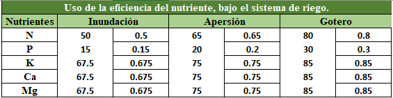

<html>

<head>

 

</head>

   <body>
   

  
<H5>
<b>Dosis a aplicar</b>
  </H5>

  <body>
  

  {height=130px}  

  
Fuente: Ivan Vidal P. 
 
  
 
   <form name="MyForm">
      <strong>Demanda del cultivo:</strong><input type="text" name="numero1" size="20">  
     <strong> Suministro del suelo:</strong><input type="text" name="numero2" size="20">  
      <strong>Eficiencia:</strong><input type="text" name="numero3" size="20">  
     <strong>Resultado:</strong>        <input type="text" name="resultado" size="20">  
     
<input type="button" value="Calcular" onclick="real()"><input type="reset" value="Eliminar">
       
  

  </form>

  
  </body>
 
 
   </body>
   
  

</html>