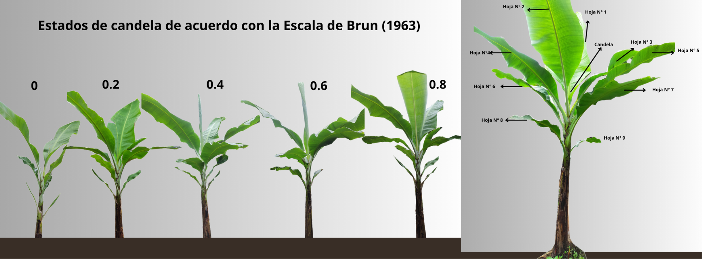

  <h5><b>Emisión foliar y conteo de hojas</b></h5>

  <body>

{height=300px}

{height=300px}

</body>

 

  

    Una vez realizada la anotación del número de hojas por planta y el estado de desarrollo de la hoja cigarro, se evalúa el nivel de infección en las hojas No. 2, 3 y 4.
  

  <form name="MyForm" class="form-center">
    
<strong>Bandera pasado (Primera hoja + bandera):</strong> 
    <input type="text" name="numero1">

    
<strong>Bandera actual (Hoja 1 o 2 + bandera):</strong> 
    <input type="text" name="numero2">

    
<strong>Emisión total:</strong> 
    <input type="text" name="resultado" readonly>

    <input type="button" value="Calcular" onclick="real()">
    <input type="reset" value="Eliminar">
  </form>

