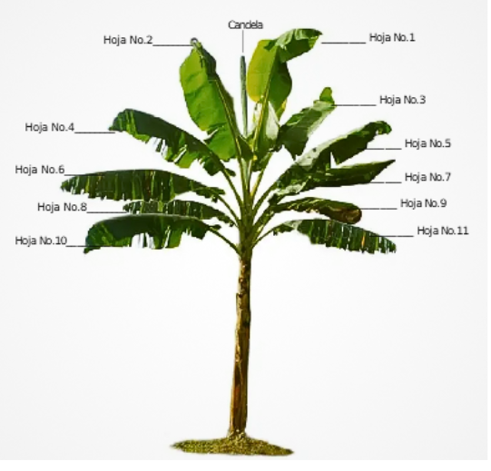

<html>

<head>

 

</head>

   <body>
   

  
<H5>
<b>Emisión foliar y conteo de hojas</b>
  </H5>
<body>

{height=300px}

{height=300px}

</body>
Una vez realizada la anotación del número de hojas por planta
y el estado de desarrollo de la hoja cigarro, se evalúa el nivel de
infección en las hojas No. 2, 3 y 4 
 
  
 
   <form name="MyForm">
      <strong>Bandera pasado( Primera hoja + bandera):</strong><input type="text" name="numero1" size="20">  
     <strong> Bandera actual(Hoja(1,2) + bandera):</strong><input type="text" name="numero2" size="20">  
     <strong>Emisión total:</strong>        <input type="text" name="resultado" size="20">  
     
<input type="button" value="Calcular" onclick="real()">
     <input type="reset" value="Eliminar">
       
  

  </form>

  
  </body>
 
 
   </body>
   
  

</html>