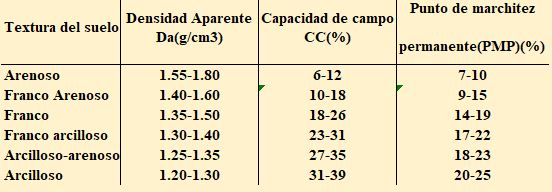

<html>

<head>

 

</head>

<body> 

 
   <body> 
    

  {height=160px} 

  
Fuente:Riego en frutales y vides  

  <H5>
<b>Calcular masa del suelo</b>
  </H5>
  <body>
    <form name="MyForm">

      Ingrese 1Ha(m2):<input type="text" name="numero1" size="20">  
      Ingrese densidad aparente(T/m3) :<input type="text" name="numero2" size="20">  
      Ingrese profundidad(m):<input type="text" name="numero3" size="20">  
     Resultado en T:        <input type="text" name="resultado" size="20">  
     
<input type="button" value="Calcular" onclick="masa()"><input type="reset" value="Eliminar">
         

  </form>

  
  </body>
 
 
   </body>
   
  

</html>

  

<html>

<head>

 

</head>

<body> 

 
   <body>  <H5>
<b>Convertir (T) A (kg) </b>
  </H5>

  <body>
    <form name="MyForm2">

      Ingrese T:<input type="text" name="numero4" size="20">  
      Ingrese 1000 kG :<input type="text" name="numero5" size="20">  
     Resultado en Kg:        <input type="text" name="resultado" size="20">  
     
<input type="button" value="Calcular" onclick="tone()">
      <input type="reset" value="Eliminar">
         

  </form>

  
  </body>

 
   </body>
   
  

  

</html>
