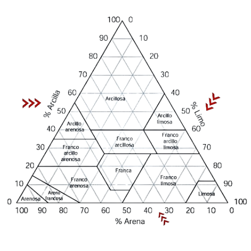

<html lang="en">
<head>
  <meta charset="UTF-8">
  <meta name="viewport" content="width=device-width, initial-scale=1.0">
  
</head>
<body>
    

<body>
      
 
        
<h2>Clase textural</h2>

       {height=325px}  
 
        
<html lang="es">
<head>
  <meta charset="UTF-8">
  <meta name="viewport" content="width=device-width, initial-scale=1.0">
  <title>Calculadora con HTML</title>
</head>
<body>
    

  <label for="valor1">Arena:</label>
  <input type="number" id="valor1" placeholder="">

  <label for="valor2">Limo:</label>
  <input type="number" id="valor2" placeholder="">
  
  <label for="valor3">Arcilla:</label>
  <input type="number" id="valor3" placeholder="">

  <button onclick="calcular()">Calcular</button>

  
Textura: 

  
</body>
</html>
