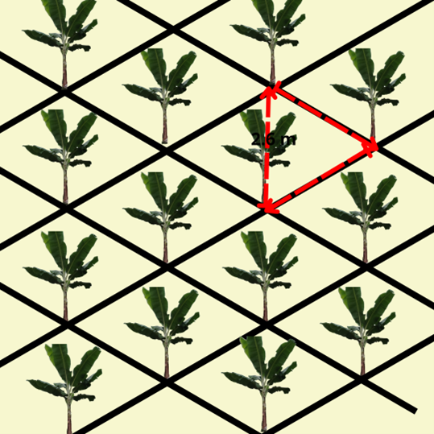

<html>

<head>

 

</head>

<body> 

 
   <body>  <H5>
<b>Calcular tres bolillos hilera sencilla</b>
  </H5>

{height=190px}
 

  <body>
    <form name="MyForm">

     <strong> Superficie a sembrar(m2) :</strong><input type="text" name="numero1" size="20">  
     <strong> Distancia entre plantas(m):</strong><input type="text" name="numero2" size="20">  
     <strong> Número de (Plantas/ha) :</strong>    <input type="text" name="resultado" size="20">  
    
 <input type="button" value="Calcular" onclick="real()"> <input type="reset" value="Eliminar"> 

         

  </form>

  
  </body>
 
  

  

</html>