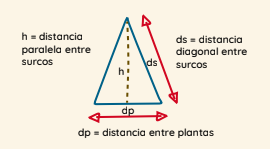

```{=html}
<div id="coca">
  <div style="text-align:center;">
    <h3 style="font-family:'Times New Roman';">Calcular triángulo</h3>
    <br>
    <strong>Módulo Cafeteros de Colombia</strong>
  </div><br>

  <form name="MyForm" style="font-family:'Times New Roman'; color:#424949; padding: 10px;">
    <label><strong>Distancia entre plantas que forman el triángulo:</strong></label><br>
    <input type="text" name="numero1" size="20"><br><br>

    <label><strong>Distancia diagonal entre surcos que forman el triángulo:</strong></label><br>
    <input type="text" name="numero2" size="20"><br><br>

    <label><strong>Distancia paralela entre surcos (h):</strong></label><br>
    <input type="text" name="resultado" size="20"><br><br>

    <div style="text-align:center;">
      <input type="button" value="Calcular" onclick="real()">
      <input type="reset" value="Eliminar">
    </div>
  </form><br>

  <form name="MyForma" style="font-family:'Times New Roman'; color:#424949; padding: 10px;">
    <label><strong>Superficie a sembrar (m²):</strong></label><br>
    <input type="text" name="numero1" size="20"><br><br>

    <label><strong>Distancia diagonal entre surcos:</strong></label><br>
    <input type="text" name="numero2" size="20"><br><br>

    <label><strong>h:</strong></label><br>
    <input type="text" name="numero3" size="20"><br><br>

    <label><strong>Densidad:</strong></label><br>
    <input type="text" name="resultado" size="20"><br><br>

    <div style="text-align:center;">
      <input type="button" value="Calcular" onclick="densi()">
      <input type="reset" value="Eliminar">
    </div>
  </form>
</div>

<script>
  function real() {
    var n1 = parseFloat(document.MyForm.numero1.value);
    var n2 = parseFloat(document.MyForm.numero2.value);
    document.MyForm.resultado.value = (Math.sqrt((Math.pow(n2, 2)) - (Math.pow((n1 / 2), 2)))).toFixed(3);
  }

  function densi() {
    var n1 = parseFloat(document.MyForma.numero1.value);
    var n2 = parseFloat(document.MyForma.numero2.value);
    var n3 = parseFloat(document.MyForma.numero3.value);
    document.MyForma.resultado.value = (n1 / (n2 * n3)).toFixed(3);
  }
</script>

<style>
  body {
   background-color: #F5F5F5;
  }

  #coca {
    width: 600px;
    margin: auto;
    background-color: #FFFFFF;
    box-shadow: 0 0 10px rgba(0,0,0,0.2);
    border: 1px solid rgba(0, 0, 0, 0.15);
    border-radius: 1em;
    padding: 20px;
    margin-top: 40px;
  }

  input[type="text"] {
    width: 95%;
    padding: 6px;
    border-radius: 4px;
    border: 1px solid #ccc;
  }

  input[type="button"],
  input[type="reset"] {
    padding: 10px 20px;
    margin: 5px;
    border-radius: 6px;
    background-color: #117A65;
    color: white;
    border: none;
    cursor: pointer;
  }

  input[type="button"]:hover,
  input[type="reset"]:hover {
    background-color: #0e6655;
  }
</style>
```
